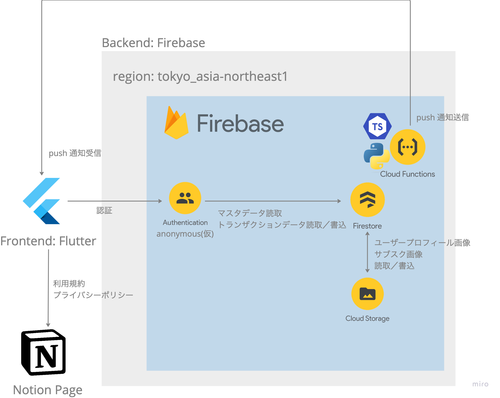
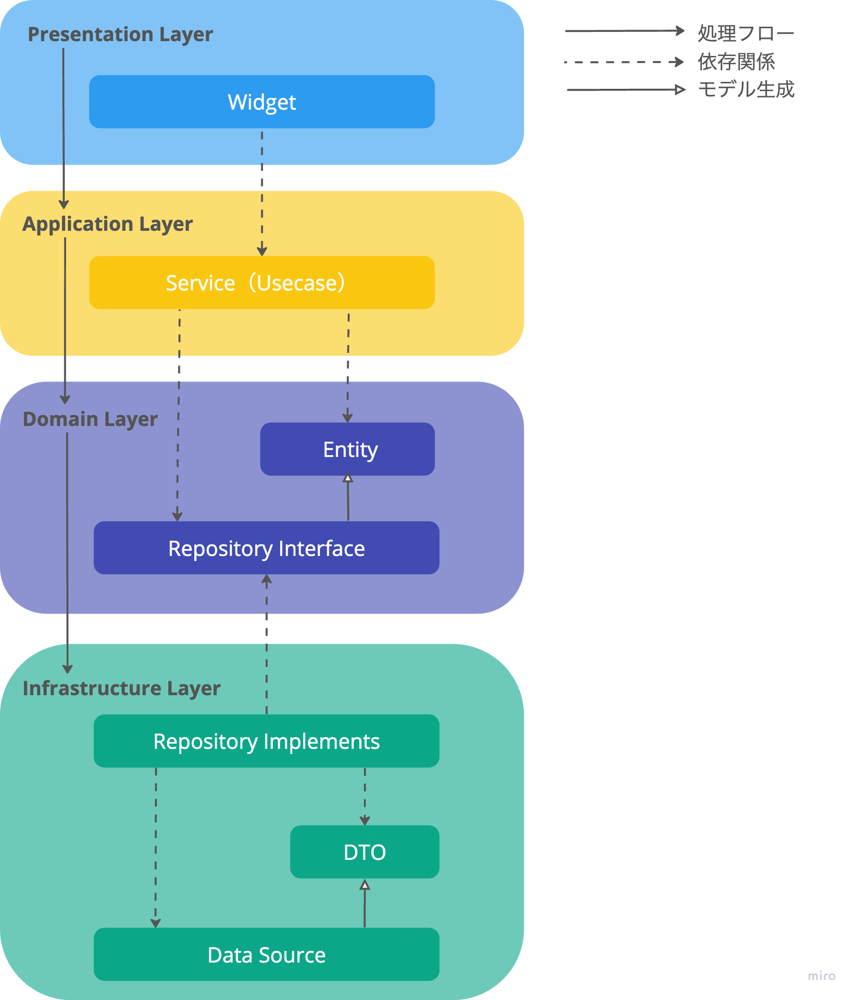

# unsubscribe_app

サブスク管理アプリ

## 開発環境のセットアップ

### `fvm` をインストールして Flutter SDK のインストールをする

次の記事を参考にして、`fvm` をインストールして、`fvm` コマンドが使える状態にしましょう。

[FVMでFlutter SDKのバージョンをプロジェクト毎に管理する](https://zenn.dev/riscait/articles/flutter-version-management)

次のコマンドを実行して本プロジェクト指定の Flutter SDK をインスト−ルをしましょう。

```plane
fvm install
```

## 実装時の Tips

### コードの自動生成

`freezed` を使った自動生成ファイルを変更した場合は次のコマンドを実行してください。

```plane
flutter pub run build_runner build --delete-conflicting-outputs
```

## アプリケーションアーキテクチャ



### フロントエンド

- Flutter
- Notion Page

### バックエンド

- Firebase
日本国内のユーザーが大半を占める想定であるため、リージョンは東京に設定しています。
  - Authentication
    - anonymous auth
  - Firestore
  - Cloud Storage
  - Cloud Functions
    - TypeScript
    - Python

## フロントエンドアーキテクチャ



4 層のレイヤードアーキテクチャを採用します。
この構成を採用することにより、各フォルダに置くべきファイルが理解しやすくなります。
その結果、今後の機能追加の際にも迷うことなく新たな処理を追加していくことが可能となります。

### ルール

1. Presentation Layer には View に関するコードを記載します。
直接 Firebase に接続するコードを記載してはいけません。
Firebase から値の取得が必要な場合は、Application Layer の Usecase クラスのメソッドをコールしてください。

1. Application Layer には Presentation Layer（View）と Firebase の橋渡しとなるコードを記載します。

1. Domain Layer にはビジネスロジックとエンティティを記載します。
本プロジェクトはエンティティの記載が主となります。

1. Infrastructure Layer には具体的なデータの取得や保存の実装を行います。
例えば、Firebase, API エンドポイント, データベースなどとの通信や操作をこの層で行います。
直接 View 側のコードから呼ばれることはありません。

### フォルダ構成

```plane
├── application                                  アプリケーション層
│   ├── state                                    アプリ全体に関わる共通状態
│   │   └── overlay_loading_provider.dart
│   └── usecase                                  ユースケース
│       ├── <関心事>
│       │   ├── state                            関心事の状態
│       │   │   └── 関心事_状態.dart
│       │   └── 関心事_usecase.dart
│       └── run_usecase_mixin.dart               ユースケース処理共通化のための mixin
├── domain                                       ドメイン層
│   ├── <関心事>
│   │   ├── entity                               関心事のentity
│   │   │   ├── 関心事_entity.dart
│   │   │   └── 関心事_entity.freezed.dart
│   │   └── 関心事_repository_interface.dart      関心事のインターフェース
│   └── service                                  関心事以外のサービス
│       └── storage_service.dart                 例えば、ストレージ関連を扱うサービス
├── infrastructure                               インフラストラクチャー層
│   └── <関心事>
│       ├── dto                                  関心事の dto
│       │   ├── 関心事_dto.dart
│       │   ├── 関心事_dto_freezed.dart
│       │   └── 関心事_dto_g.dart
│       └── repository                           関心事のモックリポジトリ 及び ドメイン層のリポジトリインターフェースを実装したリポジトリ
│           ├── mock_関心事_repository_impl.dart
│           └── 関心事_repository.dart
└── presentation                                 プレゼンテーション層
    ├── component                                アプリデザイン全般に関する共通部品
    │   ├── component_1.dart
    │   ├── component_2.dart
    │   └── component_3.dart
    ├── screen　　　　　　　　　　　                 関心事に分かれた画面
    │   ├── first_screen.dart
    └── └── second_screen.dart　　　　　　　　　　　　　　　　　　　　　　
```

## ブランチ戦略

本プロジェクトでは、数あるブランチ戦略の中でも比較的シンプルな`GitHub Flow`を採用します。


### 基本ルール

1. mainブランチは常にデプロイ可能である
1. 作業用ブランチをmainから作成する（例：feature/issue no-x)
1. 作業用ブランチを定期的にプッシュする
1. 作業用ブランチの作業が完了したらプルリクエストを作成する
1. プルリクエストが承認されたらmainブランチへマージする

### PR ルール

1. トマト + その他メンバー 1 人以上が approve したら PR 承認済みとなる
1. PR 作成者が merge する
